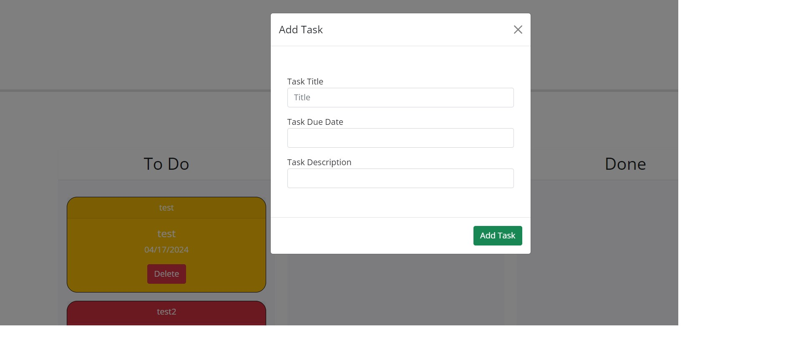

# Task Board

## Description

This is a taskboard application that allows inputting and organizing tasks. Using jQuery and Bootstrap, I took pre-written starter code and added functionality. When the 'Add Task' button is clicked, a modal pops up to allow a task title, description, and due to date to be put in. That input then displays as a card in the 'to do' column. The color of the card changes depending on whether the task due date is coming up or overdue. The cards are able to be dragged and placed in the other columns. 

I will be adding functionality to make it so that the tasks can be deleted, and stay in their previously assigned columns on resetting the page. 

## Installation

N/A

## Usage

Access updated website online at:

https://42salokin.github.io/task_board/

## Credits

I frequently used advice from other developers in my class and Stack Overflow, and the information at W3schools to assist me with putting functions, methods, and properties in proper working order.

I used jQuery and Bootstrap for much of the style and format

## License

MIT License

Copyright (c) 2024 42Salokin

Permission is hereby granted, free of charge, to any person obtaining a copy
of this software and associated documentation files (the "Software"), to deal
in the Software without restriction, including without limitation the rights
to use, copy, modify, merge, publish, distribute, sublicense, and/or sell
copies of the Software, and to permit persons to whom the Software is
furnished to do so, subject to the following conditions:

The above copyright notice and this permission notice shall be included in all
copies or substantial portions of the Software.

THE SOFTWARE IS PROVIDED "AS IS", WITHOUT WARRANTY OF ANY KIND, EXPRESS OR
IMPLIED, INCLUDING BUT NOT LIMITED TO THE WARRANTIES OF MERCHANTABILITY,
FITNESS FOR A PARTICULAR PURPOSE AND NONINFRINGEMENT. IN NO EVENT SHALL THE
AUTHORS OR COPYRIGHT HOLDERS BE LIABLE FOR ANY CLAIM, DAMAGES OR OTHER
LIABILITY, WHETHER IN AN ACTION OF CONTRACT, TORT OR OTHERWISE, ARISING FROM,
OUT OF OR IN CONNECTION WITH THE SOFTWARE OR THE USE OR OTHER DEALINGS IN THE
SOFTWARE.